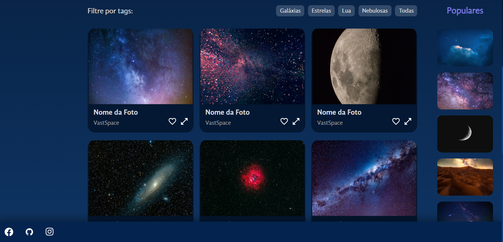
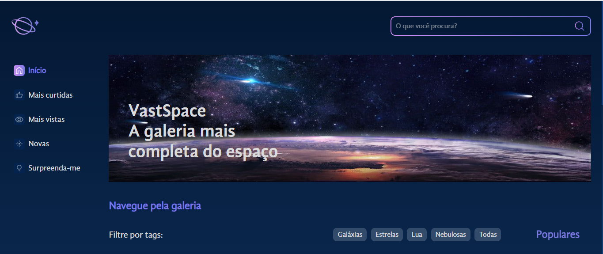

# VastSpace: Galeria de Fotos do Espaço 

VastSpace é um projeto em React que oferece uma galeria de fotos do espaço, permitindo aos usuários explorar as maravilhas do universo de forma visualmente envolvente. Utilizando a biblioteca React, o VastSpace proporciona uma experiência interativa e atraente para os entusiastas do espaço.

## Recursos e Funcionalidades

- **Galeria de Fotos do Espaço:** Os usuários podem navegar por uma coleção de fotos espetaculares do espaço, incluindo planetas, estrelas, nebulosas e galáxias. As imagens são apresentadas de forma organizada e atraente, permitindo aos usuários selecionar e visualizar fotos com facilidade.

## Tecnologias Utilizadas

O projeto VastSpace foi construído utilizando as seguintes tecnologias e ferramentas:

- **React:**
- **Css:**
- **Html:**
- **JavaScript:**

 
 ## Confira:

